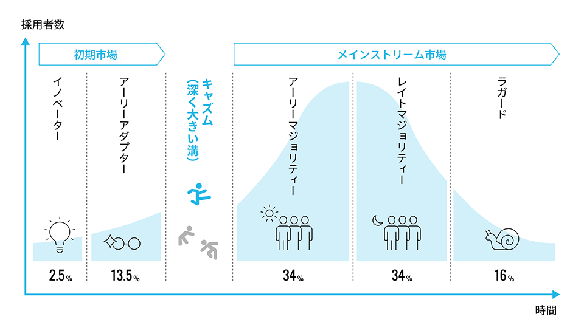

## 「未来を実装する」

### Introduction
##### 社会実装とは
- 新しい技術を社会に普及させること
- より詳しくは**キャズム**を超えてサービスが普及した状態

キャズム (chasm)

ジェフリー・ムーアが提唱した製品や技術がアーリーアダプター以降の人に広まっていかない現象や段階のこと

>参照元：https://www.cross-m.co.jp/column/marketing/mkc20240917

##### なぜ今、「社会実装」を学ぶ必要があるのか
- どんなに優れた新しいテクノロジーも社会に受け入れられなければ活きない
- 通常テクノロジーの進歩は社会の変化よりも急速に進むのに対して社会はゆっくりとしか変わらない
- 社会がテクノロジーを受容できるかにテクノロジーそのものの可能性がかかっている

**テクノロジーに合わせて社会の動かし方を学ぶ必要がある🫵**

##### 成熟社会が抱える社会実装のハードル
- 解決すべき課題の量：少ない
- 理想の提示：難しい
  - かつては欧米諸国と筆頭に目指すべき社会像が明瞭であった
  - 先進国となった今次なるモデルは新しく生み出す必要性がある
  - 誰もが思い描く未来の社会像には当然ずれがあり一丸となって同じ理想に進んでいくことが難しくなっている
- 技術への信頼：両面
  - これまでの技術革新で新しい技術に対するリスクや懸念点に対して社会がよりシビアになっている
- ニーズの多様性：高い
  - 全員のニーズを満たすのはきわめて難しく、合意形成のハードルが高まっている
- 新システムから得られる便益：比較的低い
- 新システムで損をする関係者（既得権益者）：多い

#### テクノロジーと社会変革
経済学者カルロタ・ペリッツによるとすべてのテクノロジーには

**インストール期**（導入期）
テクノロジーが市場に登場し、その新しいテクノロジーへの期待から大規模な投資が行われインフラが敷設される時期

**デプロイメント期**（展開期）
インストール期にインフラ化したテクノロジーの潜在的な価値が発揮される時期

があり、その間にはバブルと恐慌があるとしている

##### 自動車の例
- インストール期
    - 1909～1908
T型フォードがヒット
大量の需要に応えるべく流れ作業方式が確率され生産量はさらに増加
    - 1913
国が道路というインフラを敷設しその利便性が高められる
アメリカ大陸を横断する自動車用幹線道路リンカーンハイウェイ開通
物資輸送の効率化と大量生産のノウハウが普及し**大量消費の時代**へと移行
- バブルと恐慌
    - 1929
土地や株式への過剰投資により世界恐慌が発生
同時に第二次世界大戦も勃発
- デプロイメント期
    - 1943～1974
自動車と道路が整備され、大都市から離れた郊外に広い家を持つ人が急増
郊外に巨大なショッピングモールが建てられるようになる
都市よりも安い郊外の土地でものをより安価に売るディスカウントストアが登場

**つまり**
自動車の普及がディスカウントストアなどの小売ビジネスに影響を与えた
テクノロジー初期には思いつかなかったような技術の応用が想定外のビジネスにまで影響を与える

##### 情報革命に当てはめると...
- インストール期
    - 1971～
半導体の発明をきっかけにコンピュータが登場
インターネットにより情報のグローバル化が急速に進展
- バブルと恐慌
    - 2000年前後のITバブル
    - 2008年の金融危機
    - 2020年の新型コロナウイルスのパンデミックによる景気後退
- デプロイメント期
  - 現在～2040年
デジタル領域意外でもデジタル技術が使われ始める
    - デジタル技術が規制領域に深く関わり、既存の制度との調整が必要になる
ex.車道や標識の整備　運転免許証の発行
    - デジタル技術自体が規制の対象になる
ex.車の速度制限　
###### 国際政治に関するガバナンスの問題
- 1980年代日米貿易摩擦は自動車やハイテク産業を中心として発生
- 2020年では米中貿易摩擦はデジタル産業が中心
- 情報のグローバル化により国防的な視点も関与
- 今後事業者が国家レベルの政治的・知経済的な争いに巻き込まれていく
- ex.
  - 中国通信機器大手のファーウェイが米国政府の意向により一部国々の通信網から締め出される
  - ファーウェイの機器にAndroid等米国初OSの提供見送り
  - TikTokのアプリ事業運営と倍局に米国政府が関与
  
###### 業界構造の変化
- バンドル化
  - ex.銀行が金融関係すべてのサービスを運営
- アンバンドリング
  - ex.独自の電子決済サービスや個人向けの資産管理サービス、クラウドファンディングをはじめとした別の融資機会の誕生
- リバンドリング化
一度アンバンドリングされ独自に発達した機能が共通のAPIの利用などにより新たな軸の元でリバンドリングされる

が起こり、既存の業界構造が変化することで、業法のアップデートが必要になり政治との関係がより密接になる

###### 企業の多色化
現在は
- 民間
- 政府
- 社会的企業

がそれぞれの役割を担っているが、これらがより緊密に連携し、その垣根がなくなっていく時代

- **民間×政府**
スペースX・パランティア等かつては政府が行っていた公益事業を民間が請負い、スタートアップも盛んに参入している

- **民間×社会的企業**
ESG投資が盛んになることで、社会貢献が企業の価値評価に組み込まれている
社会実装に必要な実社会との調整能力という非営利企業独自のノウハウを民間企業が吸い上げる

- **社会的企業×政府**
デジタル化により規模拡大が容易に、個人に適したサービスをダイレクトに届けられるようになった
⇒NPO・NGOが自力でサービスをスケールアップできる

#### 社会実装の方法
理想の未来（＝インパクト）を描き道筋とともに提示する
- 技術面
現在と理想のギャップからｗHYとHOWの視点で優れた問いを生み出し、未来を実装する技術を生み出していく
- 社会面
**4つの原理**
1．インパクト
2．リスク
3．ガバナンス
4．センスメイキング
を用いて社会を変革する

